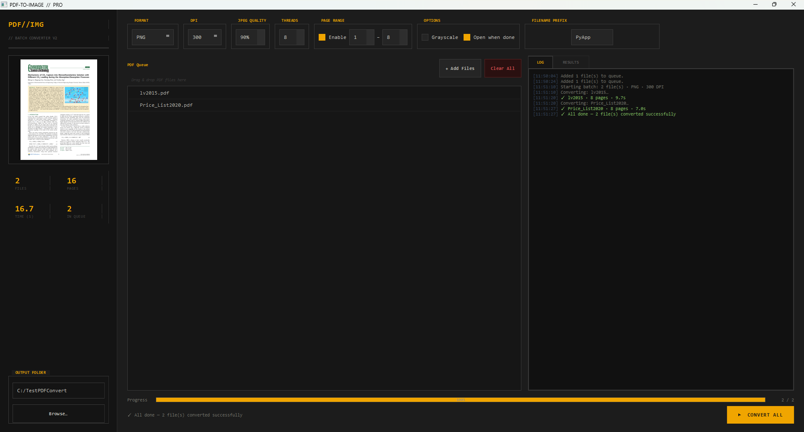

# PDF//IMG — Batch PDF to Image Converter

A professional-grade desktop application for converting PDF files to images, built with Python and PyQt5. Features a full industrial/utilitarian GUI, batch processing with a live queue, real-time previews, and multi-format output — with zero file-locking issues on network/UNC paths.


---

## Features

### Conversion
- **5 output formats** — PNG, JPEG, TIFF, WebP, BMP
- **Configurable DPI** — 72 / 96 / 150 / 200 / 300 / 400 / 600
- **JPEG quality control** — 10–100% with optimize flag
- **WebP quality control** — with method 6 compression
- **TIFF LZW compression** — automatic
- **PNG optimize** — automatic
- **Grayscale mode** — convert to greyscale on output
- **Page range selection** — convert specific page ranges, not just full PDFs
- **Configurable thread count** — 1–16 threads via Poppler
- **Filename prefix** — prepend a custom string to all output folder/file names
- **Custom output folder** — or default to same directory as the source PDF

### GUI & UX
- **Drag & drop** — drop PDFs directly onto the queue; duplicates are silently ignored
- **Live PDF preview** — renders the first page of the selected PDF via PyMuPDF, no temp files
- **Batch queue** — load multiple PDFs, reorder, remove individually, or clear all
- **Right-click context menu** — Remove from queue / Reveal in Explorer (Windows), Finder (macOS), or file manager (Linux)
- **Real-time stats** — files converted, total pages, total elapsed time, queue count
- **Live conversion log** — timestamped, colour-coded (info / success / error)
- **Results tab** — per-file summary with page count and elapsed time
- **Abort button** — cleanly stops a running batch mid-way
- **"Open when done"** — auto-reveals the output folder after each file
- **Industrial/utilitarian theme** — Consolas monospace, amber accent (`#f0a500`), sharp rectangular UI

### Reliability
- **No WinError 32 / file-locking** — images are returned as PIL objects in memory and saved directly; no intermediate temp files on disk and no rename step, making it safe on UNC/network paths (`\\server\share\...`)
- **Per-page memory release** — `img.close()` called immediately after save to keep RAM flat on large documents
- **Worker thread** — conversion runs off the main thread; GUI stays fully responsive

---

## Screenshots

> 

---

## Requirements

### Python
Python 3.8 or newer.

### System dependency — Poppler
`pdf2image` requires Poppler binaries on the system PATH.

**Windows**
1. Download the latest Poppler for Windows from [oschwartz10612/poppler-windows](https://github.com/oschwartz10612/poppler-windows/releases)
2. Extract and add the `bin/` folder to your system PATH, or pass `poppler_path=r"C:\path\to\poppler\bin"` directly to `convert_from_path()` in the source.

**macOS**
```bash
brew install poppler
```

**Linux (Debian/Ubuntu)**
```bash
sudo apt install poppler-utils
```

---

## Installation

```bash
git clone https://github.com/aggelosy/pdf-img-converter.git
cd pdf-img-converter
pip install -r requirements.txt
```

---

## Running

```bash
python pdf_converter_pro.py
```

---

## Dependencies

```
pdf2image>=1.16
PyMuPDF>=1.23
PyQt5>=5.15
Pillow>=9.0
```

All installable via:
```bash
pip install pdf2image PyMuPDF PyQt5 Pillow
```

A `requirements.txt` is included in the repo.

---

## Usage

1. **Load PDFs** — click `+ Add Files` or drag and drop PDF files onto the queue
2. **Configure** — set format, DPI, quality, threads, page range, and output folder in the top controls
3. **Preview** — click any queue item to see a live first-page preview in the sidebar
4. **Convert** — click `▶ CONVERT ALL`; monitor progress in the log and results tabs
5. **Access output** — right-click any result item and choose *Reveal in Explorer* (or enable *Open when done*)

Output files are named `<pdf-name>-0001.png`, `<pdf-name>-0002.png`, etc., inside a subfolder named after the PDF (or your custom prefix + PDF name), placed in either the PDF's own directory or your chosen output folder.

---

## Project Structure

```
pdf-img-converter/
├── pdf_converter_pro.py   # Main application (single file)
├── requirements.txt
└── README.md
```

---

## Known Limitations

- Preview renders only the **first page** of the selected PDF (by design — keeps it fast)
- WebP output requires Pillow built with WebP support (standard pip install includes it)
- On very large PDFs (500+ pages), memory usage scales with `thread_count` — reduce threads if needed

---

## License

MIT — free to use, modify, and distribute.
